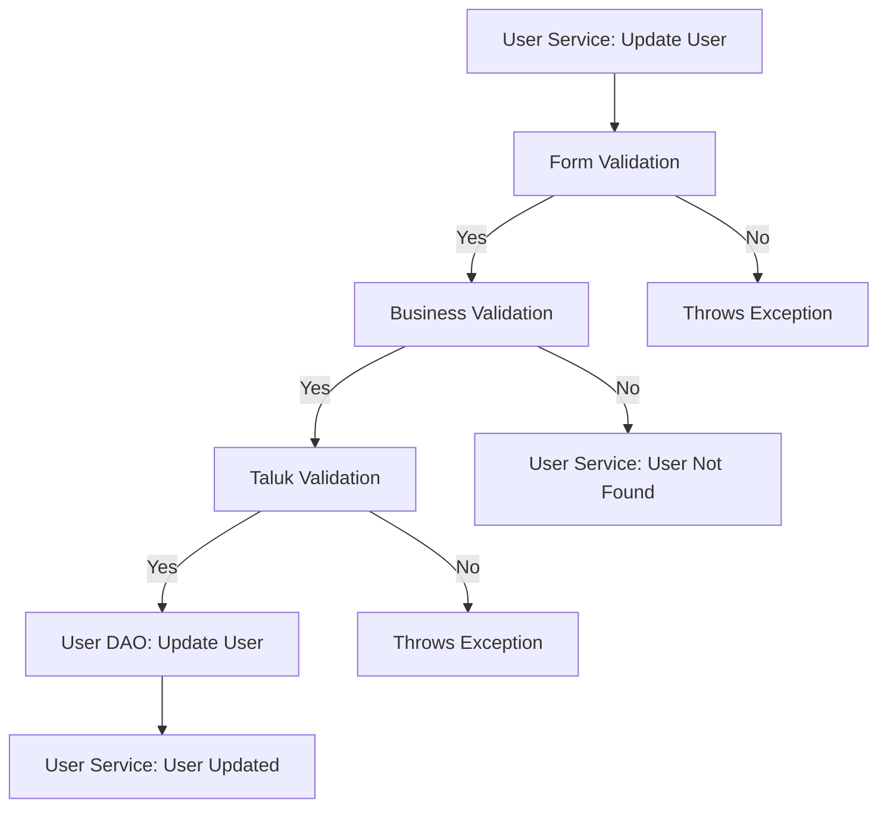
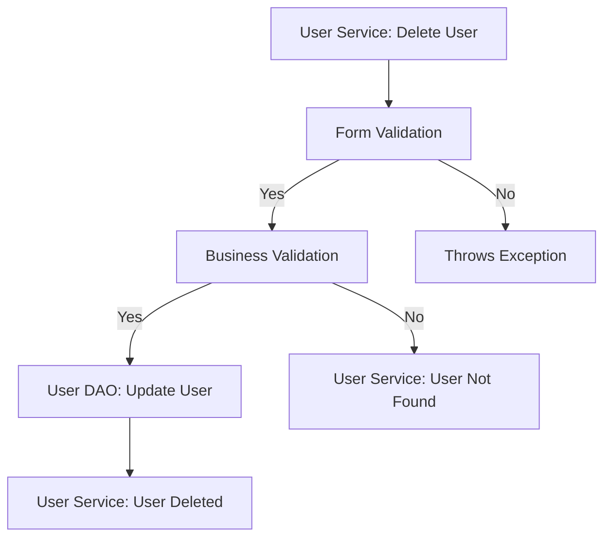
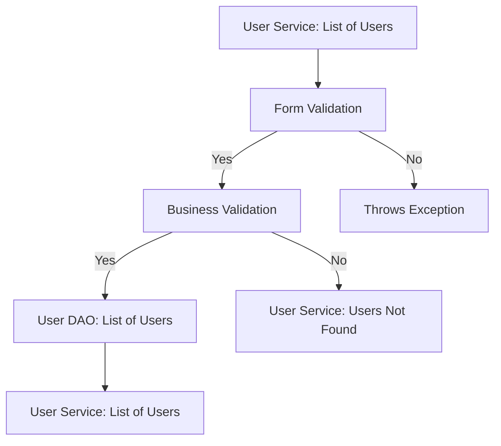
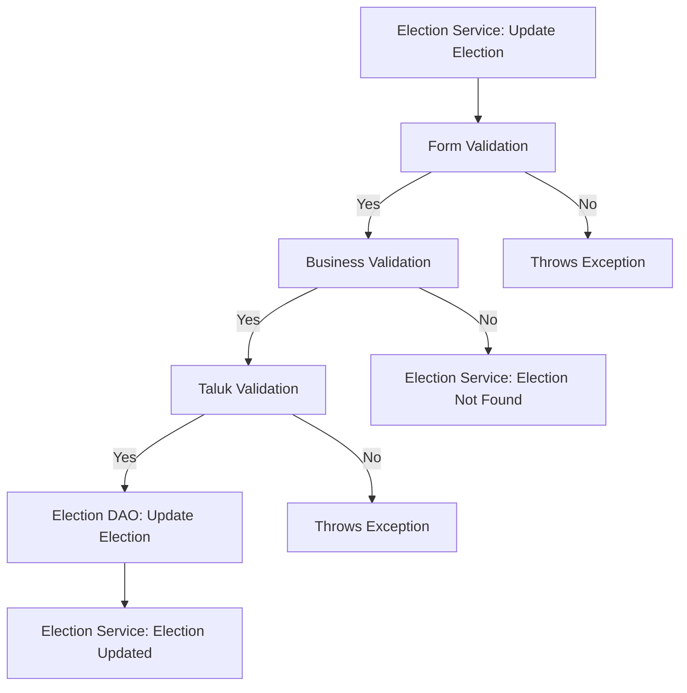
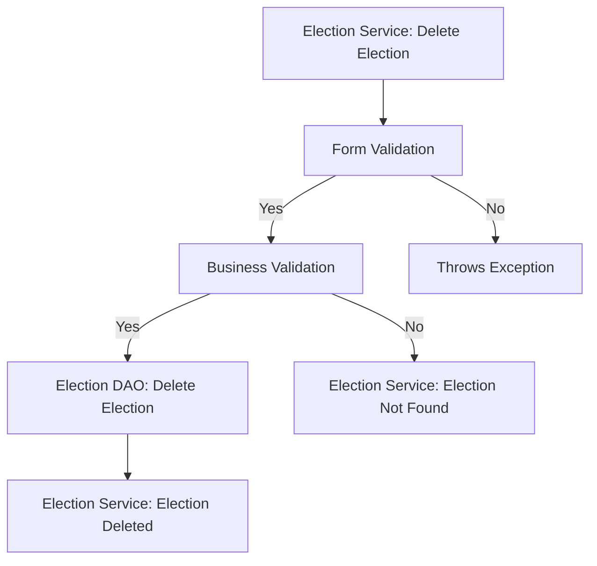
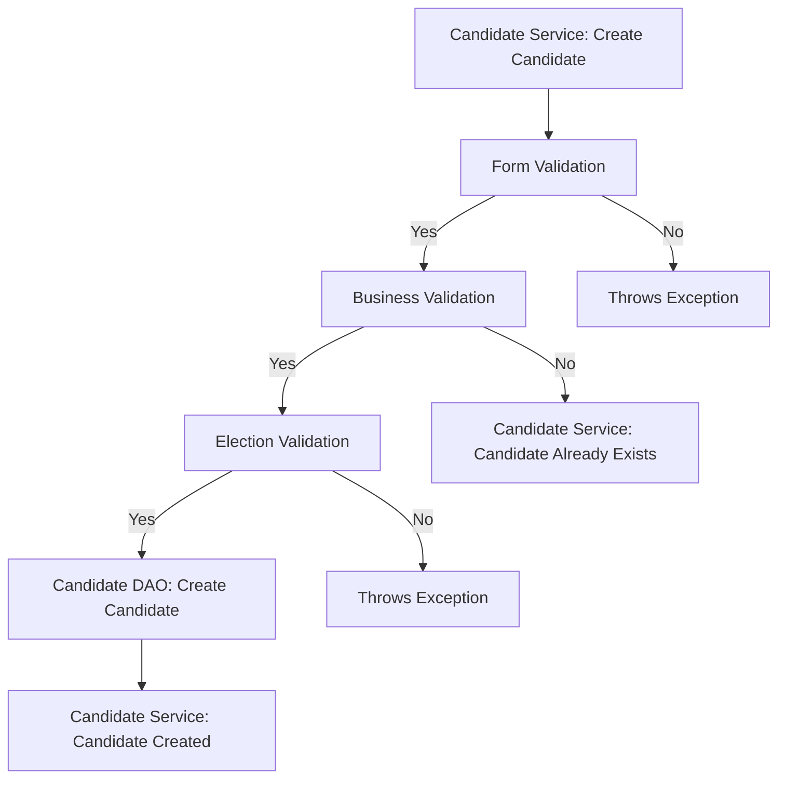
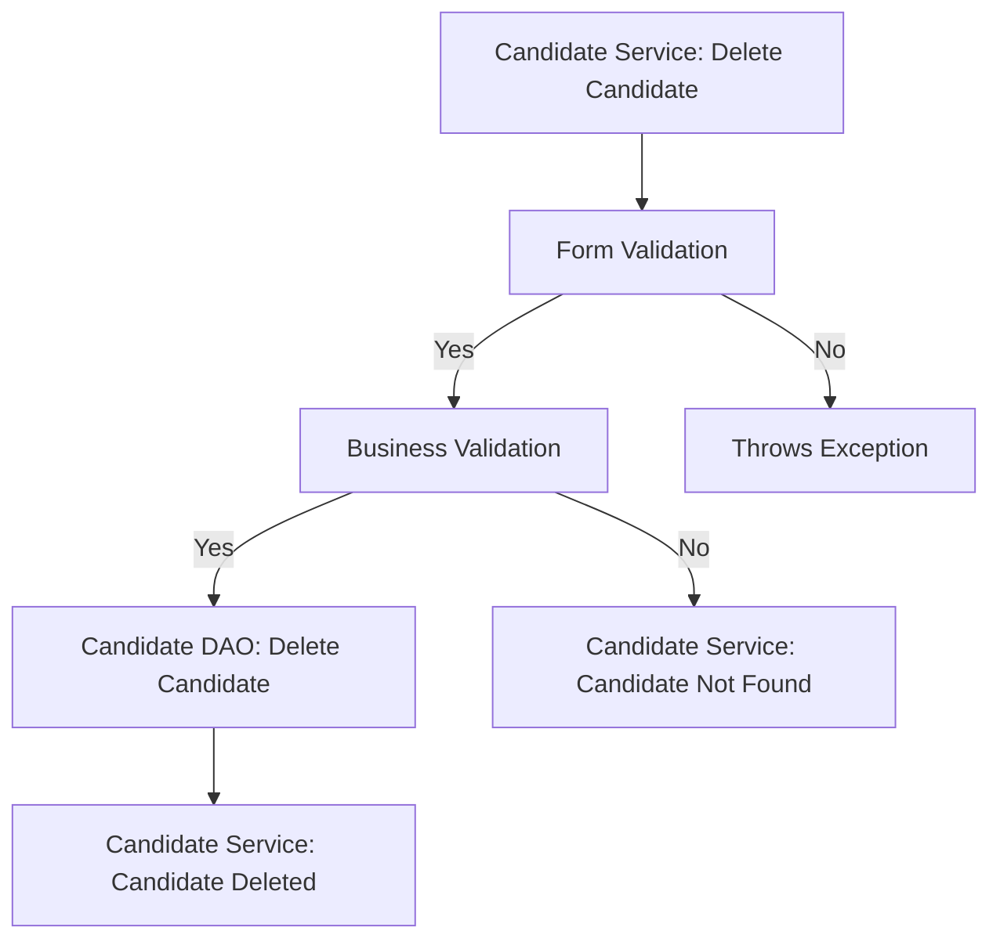

  

# E-Vote System

## Database Design

  

- [ ] Create an ER diagram of the database

- [ ] Write Create table scripts [script]

  

  

## Project Setup

  

- [ ] Create a new Java project

- [ ] Set up a MySQL database

- [ ] Add necessary libraries

- [ ] JDBC,

- [ ] MySQL Connector,

- [ ] JUnit,

- [ ] Dotenv

  
  

## Module: User

- [ ] users table

- [ ] user Entity model ( abstract class )

* Attributes

* int user id;

* long phone Number;

* String password;

* int voter id;

* int taluk id;

* Boolean isActive ;

### Feature: Create User

>Create a new user in a database.

#### Pre-requisites:

- [ ] taluk table

- [ ] taluk DAO (create taluk)

- [ ] taluk service (create (Taluk taluk))

- [ ] user table

- [ ] user DAO (create user )

- [ ] user service ( create (User user) )

#### Validations:

- [ ] Form Validation

* create( User user )

* user null

* user id (>0)

* password ( null, empty, pattern )

* voter id (>0)

* taluk id (>0)

* phone number ( length, >= 600000001 && <= 9999999999 )

create( Taluk taluk)

* id (>0)

- [ ] Business Validation

* check the User Already exists

* check the Taluk

#### Messages:

* Invalid User object

* Invalid password input

* Invalid phone number input

* Invalid Voter Id input

* User already exists

* Invalid Taluk object

* Invalid Taluk id

#### Flow:

  

### Feature : Update User

>Update user in a database.

#### Pre-requisites:

- [ ] Complete create User feature

- [ ] taluk table

- [ ] taluk DAO (update taluk)

- [ ] taluk service (update (Taluk taluk))

- [ ] user table

- [ ] user DAO (update user )

- [ ] user service ( update (User user) )

  

#### Validations:

- [ ] Form Validation

* update ( User user )

* user null

* user Id (>0)

* password ( null, empty, pattern )

* phone number ( length, >= 600000001 && <= 9999999999 )

* voter Id (>0)

* taluk Id (>0)

* update (Taluk taluk)

* id (>0)

- [ ] Business Validation

* check the user and update

* check the Taluk

#### Messages:

* Invalid User object

* Invalid User Id input

* Invalid password input

* Invalid phone number input

* Invalid voter Id input

* User not found

* Invalid Taluk Object

* Invalid Taluk Id

#### Flow:

  

### Feature: Delete User

>Delete user in a database.

#### Pre-requisites:

- [ ] Complete create User feature

- [ ] user table

- [ ] User DAO( delete User)

- [ ] User service ( delete (int user id) )

#### Validations:

- [ ] Form Validation

* delete ( User user )

* user id(>0)

- [ ] Business Validation

* check the user and delete

#### Messages:

* Invalid User Id input

* User not found

#### Flow:

  

### Feature: List all Users

>List all user in a database.

#### Pre-requisites:

- [ ] complete create User feature

- [ ] user table

- [ ] User DAO( list All Users)

- [ ] User service ( list All ( ) )

  

#### Flow:

  

## Module: Election

- [ ] election table

- [ ] election Entity model ( abstract class )

* Attributes

* int election id;

* String election name;

* String booth address;

* int taluk_id;

* localDate end_date;

### Feature: Create Election

>Create a new election in a database.

#### Pre-requisites:

- [ ] taluk table

- [ ] Taluk DAO (create Taluk)

- [ ] Taluk service (create (Taluk taluk))

- [ ] election table

- [ ] Election DAO( create Election)

- [ ] Election service ( create(Election election) )

  

#### Validations:

- [ ] Form Validation

* create( Election election)

* election null

* election Name (null, empty)

* election id (>0)

* taluk id (>0)

* booth Address (null, empty)

* end Date (>current date)

* create( Taluk taluk)

* id (>0)

- [ ] Business Validation

* check Election Already exists

* check the Taluk

#### Messages:

* Invalid Election object

* Invalid election Id input

* Invalid End Date input

* Election already exist

* Invalid Taluk object

* Invalid taluk Id

#### Flow:

### Feature: Update Election Details

>Update Election details in a database.

#### Pre-requisites:

- [ ] complete create election feature

- [ ] taluk table

- [ ] Taluk DAO ( update Taluk)

- [ ] Taluk Service ( update (Taluk taluk))

- [ ] election table

- [ ] Election DAO( update Election)

- [ ] Election service ( update (Election election))

  

#### Validations:

- [ ] Form Validation

* update( Election election )

* election null

* election Name( null, empty)

* booth Address( null, empty)

* election id (>0)

* taluk id(>0)

* endDate(>current date)

* update Taluk (Taluk taluk)

* id(>0)

- [ ] Business Validation

* check the election and update

* check the Taluk

#### Messages:

* Invalid Election object

* Invalid election id input

* Invalid election Name input

* Invalid Date input

* election not exist

* Election not found

* Invalid Taluk object

* Invalid taluk Id

#### Flow:

### Feature: Delete Election

>Delete Election in a database.

#### Pre-requisites:

- [ ] Complete create election feature

- [ ] election table

- [ ] Election DAO( delete Election )

- [ ] Election service ( delete (int election Id) )

#### Validations:

- [ ] Form Validation

* delete ( Election election)

* election Id(>0)

- [ ] Business Validation

* check the election and delete

#### Messages:

* Invalid election Id

* election not found

#### Flow:

### Feature: List all Elections

>List all Election in a database.

#### Pre-requisites:

- [ ] complete create election feature

- [ ] election table

- [ ] Election DAO( list All Elections)

- [ ] Election service ( list All ( ) )

  

#### Flow:

  

## Module: Candidate

- [ ] candidate table

- [ ] candidate Entity model ( abstract class )

* Attributes

* int candidate id;

* String candidate name;

* int election id;

* localDate created at;

### Feature: Create Candidate

>Create a new Candidate in a database.

#### Pre-requisites:

- [ ] candidate table

- [ ] election table

- [ ] Candidate DAO( create Candidate )

- [ ] Candidate service ( create(Candidate candidate ))

- [ ] Election DAO (create Election)

- [ ] Election Service ( create (Election election))

#### Validations:

- [ ] Form Validation

* create( Candidate candidate )

* candidate null

* candidateName (null, empty)

* candidate_id (>0)

* election_id (>0)

* create_at (>current date)

* create (Election election)

* election null

* id (>0);

- [ ] Business Validation

* check Election

* check Candidate Already exists

#### Messages:

* Invalid Candidate object

* Invalid Candidate Id input

* Invalid Create Date input

* Invalid Candidate Name input

* Candidate already exists

* Invalid Election object

* Invalid Election Id

#### Flow:

  

### Feature: Update Candidate details

>Update candidate details in a database.

#### Pre-requisites:

- [ ] complete create candidate feature

- [ ] candidate table

- [ ] election table

- [ ] Candidate DAO( update Candidate)

- [ ] Candidate service ( update (Candidate election) )

- [ ] Election DAO (update Election)

- [ ] Election Service ( update (Election election))

#### Validations:

- [ ] Form Validation

* update( Candidate candidate )

* candidate null

* candidate Name( null, empty)

* candidate Id (>0)

* election id (>0)

* created at (>current date)

* create (Election election)

* election null

* id(>0);

- [ ] Business Validation

* check the Election

* check the candidate and update

#### Messages:

* Invalid Candidate object

* Invalid candidate id input

* Invalid Date input

* Invalid taluk input

* candidate not found

* Invalid Election object

* Invalid election Id

#### Flow:

### Feature: Remove Candidate

>Update remove candidate in a database.

#### Pre-requisites:

- [ ] Complete create candidate feature

- [ ] candidate table

- [ ] Candidate DAO( delete Candidate )

- [ ] Candidate service ( delete (int candidate id) )

#### Validations:

- [ ] Form Validation

* delete ( Candidate candidate )

* candidate id(>0)

- [ ] Business Validation

* check the candidate and delete

#### Messages:

* Invalid Candidate Id

* candidate not found

#### Flow:

  

### Feature: List all Candidates

>List all candidates in a database.

#### Pre-requisites:

- [ ] complete create Candidate feature

- [ ] candidate table

- [ ] Candidate DAO( list All Candidates )

- [ ] Candidate service ( list All ( ) )

  

#### Flow:

